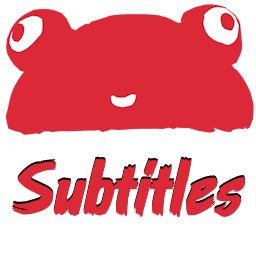
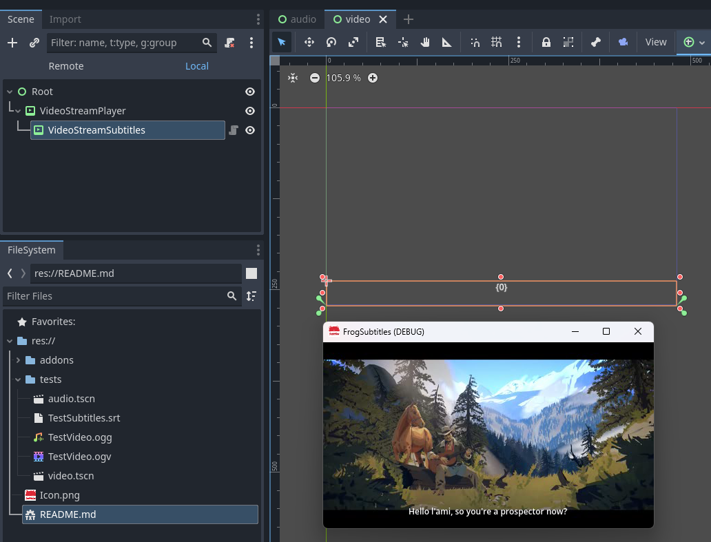
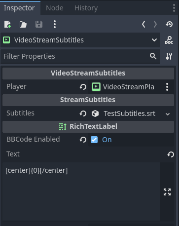

#  Frog Subtitles

Frog Subtitles is a Godot plugin that add custom nodes to easily add subtitles on a video or audio stream. It works by directly importing a standard srt file ([srt file format specifications](https://docs.fileformat.com/video/srt/)).

This plugin has been developed by [Frog Collective](http://frog-collective.com).

## Installation

Godot .NET v4.0 or greater is needed to install this plugin. After adding it to your Godot project, you need to successfully build your C# solution before activating it in the plugin tabs of your Project Settings.

Once the plugin is enabled, you will be able to see srt files in Godot file system.

## Usage

`VideoStreamSubtitles` and `AudioStreamSubtitles` nodes are built on top of a `RichTextLabel`, so you can use all its property to place it whenever you like.

It is also possible to customize the way subtitles are formatted by entering a template in the `Text` property. For example, you can center the subtitle by using the template `[center]{0}[/center]`. Don't forget to activate BBCode to make it work.

The template use C# [string.Format](https://learn.microsoft.com/en-us/dotnet/api/system.string.format?view=net-8.0), so you can use all the C# format syntax. The subtitle is replace on argument `{0}`.

You can open the test scenes `tests\audio.tscn` and `tests\video.tscn` to see how subtitle integration can be made.

## SRT edition

To easily edit srt files, you can use any compatible software. [Subtitle Edit](https://www.nikse.dk/subtitleedit) is a very nice Open Source subtitle editor.

## License

The plugin is licensed under the [MIT license](LICENSE).

The tests assets `tests\TestVideo.ogv`, `tests\TestVideo.ogg` and `tests\TestSubtitles.srt` are under copyright and cannot be used by anyone except Frog Collective.
